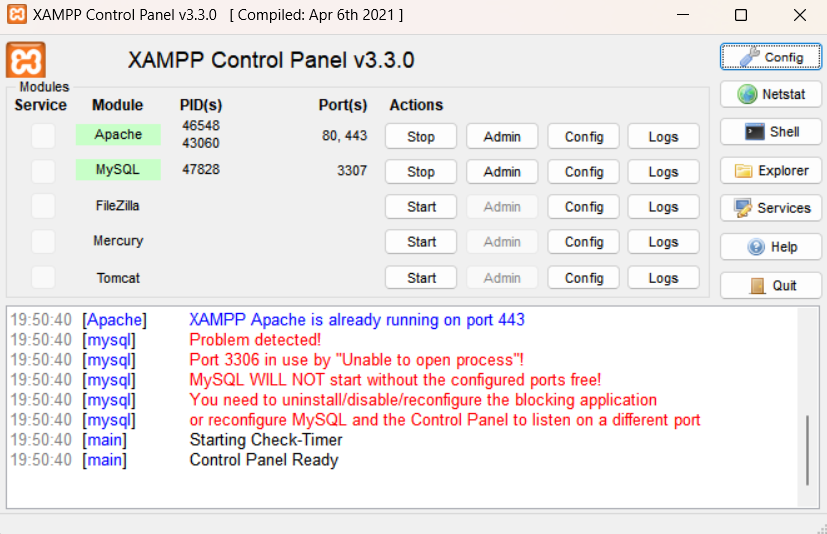
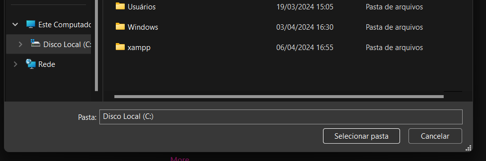

<h1 align="center">
    Coronavírus Dashboard
</h1>

   <b><i>A Brief Description.</i></b> 

        
        
	
        

    <samp>
    <a href="#About">ABOUT</a>
   | <a href="#Technologies">TECHNOLOGIES</a>
   | <a href="#Usage">USAGE</a>
   | <a href="#Resources">RESOURCES</a>
   | <a href="#Documentation">DOCUMENTATION</a>
   | <a href="#Feedbacks">FEEDBACKS</a>
     </samp>

<h2 id="About">📋About</h2>

>*O exercício consistirá na construção de um sistema (interface web) que possibilite ao usuário obter informações sobre os casos de mortes por Covid. Estes dados serão obtidos por meio da API-Covid-19 que está >disponível no servidor da Kidopi. É possível obter dados do número de casos confirmados e mortes de vários países afetados pela COVID-19.*  

<h2 id="Technologies">🛠️ Technologies</h2>

- `PHP`
- `JavaScript`
- `HTML`
- `CSS`
- `Chart.js`
- `MySQL`

<h2 id="Screenshot">🛠️ Screenshot</h2>

<h2 id="Video">🎥 Video</h2>

<h2 id="Dependências">📲 Dependências</h2>

- **XAMPP Control Panel v3.3.0**: Utilizado para criar um ambiente de desenvolvimento local.
- **PHP v8.2.12**: Linguagem utilizada no backend.
- **JavaScript, CSS3, HTML5**: Construção da interfaces para o usuário.
- **Chart.js 4.4.2**: Biblioteca JavaScript para criação de gráficos e visualizações de dados.

<h2 id="Configuração">📲 Como Inicializar e Configurar</h2>

Para rodar o projeto localmente, é necessário ter os programas já instalados:
1. [PHP](https://www.php.net/)
2. [XAMPP](https://www.apachefriends.org/index.html)
3. [Composer](https://getcomposer.org/)

Caso não os tenha, recomendo seguir a ordem dos tutoriais:
1. Como Instalar XAMPP:
   [Link](https://www.youtube.com/watch?v=VCHXCusltqI)

2. Como Instalar PHP e Composer: 
   [Link](https://www.youtube.com/watch?v=pS0U-PsXUlg)

**Observação:** No tutorial de Instalação do Composer, no Setup, é **importante** utilizarmos o caminho do arquivo correto.  
Assim como está descrito: `C:\xampp\php\php.exe`

1. Tenha o Xampp Instalado com os ambientes propriamente rodando

2. Tenha certeza  que esteja com o arquivo xampp na localização C:

3. Abra o arquivo xampp localizado no Disco Local (C:)
4. Dentro de xampp, abra o arquivo chamado htdocs
5. Então, abra o arquivo API-Covid-19

para adicionar uma senha ao login do phpmyadmin
https://youtu.be/LltCLFxQ2Yk?si=LBwfhjo7HOrWLCBH

<h2 id="Contact">📲 Contact</h2>

## © Credits
Credit Card Icon: [pluspng.com](https://pluspng.com/)
