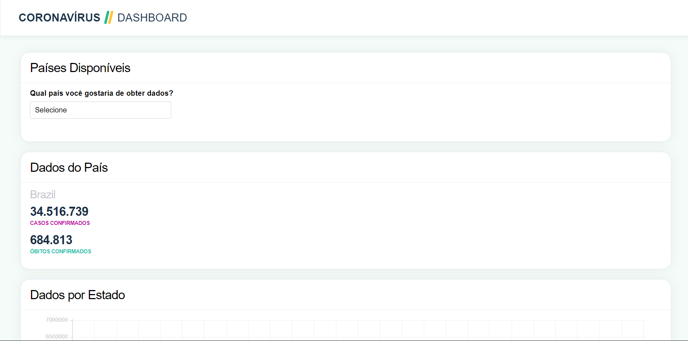
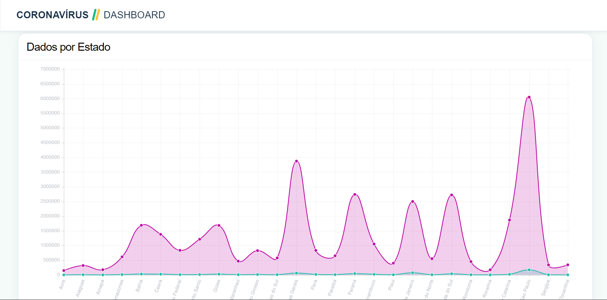
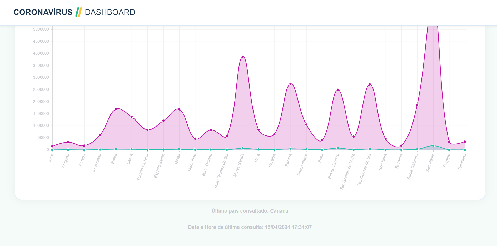

<p align="center">

</p>

<h1 align="center">
    Coronavírus Dashboard
</h1>

<p align="center">
   <b><i>Exibição dos Dados de Óbitos e Casos de Covid-19 nos países Brazil, Canada e Australia.</i></b><br>
</p>


<p align="center">
        
        
	
      <!--   -->
</p>


<p align="center">
    <samp>
    <a href="#Sobre">SOBRE</a>
   | <a href="#Tecnologias">TECNOLOGIAS</a>
   | <a href="#Dependências">DEPENDÊNCIAS</a>
   | <a href="#Inicialização">INICIALIZAÇÃO</a>
   | <a href="#BD">BANCO DE DADOS</a>
   | <a href="#Screenshots">SCREENSHOTS</a>
   | <a href="#Vídeo">VÍDEO</a>
   | <a href="#Melhorias">MELHORIAS</a>
   | <a href="#Contato">CONTATO</a>
     </samp>
</p>


<h2 id="Sobre">📜 Sobre</h2>

>**Coronavirus Dashboard** é um sistema que permite o usuário obter informações sobre os casos de mortes e confirmados que foram afetados pela Covid-19. <br>
>Ele fornece dados sobre o número de casos confirmados e mortes em três países específicos. <br>

**Deploy:** https://coronavirus-dashboard.000webhostapp.com/ 
<br>
**Inspiração:** Front-end inspirado no site [Coronavírus Brasil](https://covid.saude.gov.br/)

<h2 id="Tecnologias">🛠️ Tecnologias</h2>

- `XAMPP`
- `PHP`
- `MySQL`
- `JavaScript`
- `CSS`
- `HTML`
- `Chart.js`

<h2 id="Dependências">📦 Dependências</h2>

- **XAMPP Control Panel v3.3.0**: Utilizado para criar um ambiente de desenvolvimento local.
- **PHP v8.2.12**: Linguagem utilizada no backend.
- **MySQL**: Banco de Dados para guardar os horários e datas de acesso.
- **JavaScript, CSS3, HTML5**: Construção da interface para o usuário.
- **Chart.js 4.4.2**: Biblioteca JavaScript para criação de gráficos e visualizações de dados.

### Instalação
**Composer**
````
composer install
````
**Chart.js**
````
npm install chart.js
````


<h2 id="Inicialização">⚙️ Como Inicializar e Configurar</h2>

Para rodar o projeto localmente, é necessário ter os seguintes programas instalados:
- [PHP](https://www.php.net/)
- [XAMPP](https://www.apachefriends.org/index.html)
- [Composer](https://getcomposer.org/)

### Caso não os tenha, recomendo seguir a ordem dos tutoriais:
- Como instalar **XAMPP**:
   [LINK](https://www.youtube.com/watch?v=VCHXCusltqI)

- Como instalar **PHP** e **Composer**: 
   [LINK](https://www.youtube.com/watch?v=pS0U-PsXUlg)

>**OBS:**  No tutorial de instalação do **Composer**, é importante utilizar o caminho do arquivo correto. <br>
Assim como está descrito: `C:\xampp\php\php.exe`* <br>


## Dependências Instaladas? Vamos rodar:
- Abra o **XAMPP** e clique no botão `start` dos serviços `Apache` e `MySQL`

- Com os serviços rodando, abra o diretório local `C:\xampp\htdocs` e clone o projeto:
````
$ git clone https://github.com/kellymoreira/Coronavirus-Dashboard.git
````
**Importante** 
<br>
Tenha certeza de abrir o arquivo `coronavirus-dashboard` na localização:
`C:\xampp\htdocs\coronavirus-dashboard`

Com tudo funcionando, digite no navegador: <br>
http://localhost/coronavirus-dashboard/


<h2 id="BD">🗃️ Banco de Dados</h2>

**phpMyAdmin** foi utilizado para administrar os dados de acesso aos logs:
- Data e horário do último acesso `(dd/mm/aaaa - hh:mm:ss)`
- Qual país foi consultado `(Brazil, Australia ou Canada)`

### Configurando:

Crie um arquivo `.env` com as informações específicas do Banco de Dados criado
```
DB_HOST=host
DB_NAME=database
DB_USER=user
DB_PASSWORD=password
```

**SQL preview**
```sql
CREATE TABLE `covid_19`.`access_records` (
`id` INT NULL AUTO_INCREMENT , 
`access_date_time` DATETIME NOT NULL , 
`country` VARCHAR(50) NOT NULL , 
PRIMARY KEY (`id`)) ENGINE = InnoDB;
```


Para a conexão funcionar corretamente, vale ressaltar a importância de possuir uma senha configurada. <br>
Quando acessado o Banco de Dados de início, não há uma senha pré-configurada.
Caso não possuir, assista esse vídeo para configurar uma: [LINK](https://youtu.be/LltCLFxQ2Yk?si=LBwfhjo7HOrWLCBH)


<h2 id="Screenshots">📸 Screenshots</h2>







<h2 id="Vídeo">🎥 Vídeo Preview</h2>

https://github.com/kellymoreira/Coronavirus-Dashboard/assets/129607885/7598248c-ab0b-45e1-a49a-146f2e585b49


<h2 id="Melhorias">💡 Melhorias em mente</h2>

- **Interface**: Separar 'Países Disponíveis' e 'Dados do País' em duas colunas.
- **Apariçãos dos Dados**: Ao invés do padrão ser 'Brazil', mostrar primeiro que o usuário deve escolher um país, e então mostrar os dados.
- **Barra de Navegação**: Adicionar uma barra de navegação no canto superior direito.
- **Responsividade**: Organizar de maneira mais precisa como o site é visualizado por diferentes dispositivos


<h2 id="Contato">☎️ Contato</h2>

<a href="https://www.linkedin.com/in/kelly-cristina-moreira/">
    
</a>
<a href="mailto:kelly.moreira0510@gmail.com">
    
</a>

<br>

<br>
<p align="left">
  
</p>
